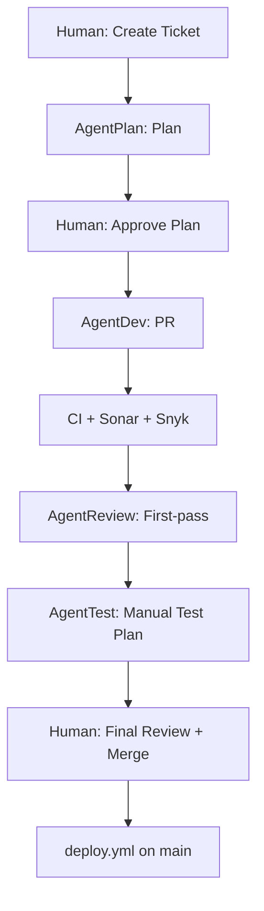

## Agent-driven GitHub lifecycle

This project defines an agent-driven development lifecycle using GitHub Issues and GitHub Actions: issue intake → plan validation → implementation PR → automated quality gates (Sonar + Snyk) → AI first-pass PR review → manual test-case authoring → **human final review and merge** → deploy via GitHub Actions.

### Goals

- Turn a GitHub Issue into a repeatable, auditable workflow where agents can plan, implement, review, quality-check, and propose tests.
- Keep the human in control at plan approval, **final PR review / merge**, and optional deployment environment approval.
- Make quality gates (Sonar + Snyk) blocking and visible on PRs.

### Algorithm

1. **Human** — Add issue label **`status:ready`** (meaning **ready for planning**) to start AgentPlan. See [`docs/labels.md`](labels.md).
2. **AgentPlan** — Write plan to `.cursor/plans/`; push; remove **`status:ready`**; assign back to human.
3. **Human** — Approve plan (`status:plan_approved`); add issue label **`status:in_progress`** (meaning **ready for implementation**) to start AgentDev.
4. **AgentDev** — Implement saved plan; open PR (`Closes #n`); label PR **`agent:review`**; apply lifecycle labels on the issue/PR per [`docs/labels.md`](labels.md) (no GitHub Project Status).
5. **Automated** — CI, Sonar, Snyk on the PR.
6. **AgentReview** — First-pass review; does not merge (triggered by PR label **`agent:review`**).
7. **Human** — Add PR label **`status:test_plan_requested`** to request AgentTest.
8. **AgentTest** — Manual test checklist; does not merge.
9. **Human** — Merge to `main`.
10. **GitHub Actions** — [`deploy.yml`](../.github/workflows/deploy.yml) on push to `main`.

### High-level workflow

### Roles and responsibilities

- **Human**: creates issues, applies **router labels** per [`docs/labels.md`](labels.md), validates plans, performs **final PR review and merge**, optionally approves deploys (environment protection).
- **AgentPlan**: produces plans from issues and hands work back to the human for validation.
- **AgentDev**: implements approved plans, opens PRs, and keeps issues updated.
- **AgentReview**: first-pass PR review (comments / request changes); does **not** replace human merge authority.
- **AgentTest**: derives manual test plans from acceptance criteria and changed areas; does not execute tests in CI.
- **GitHub Actions** ([`router.yml`](../.github/workflows/router.yml)): calls Cursor Automation webhooks from **issue/PR labels** (and `workflow_dispatch` for plan replay). **Deploy** runs only in [`deploy.yml`](../.github/workflows/deploy.yml) after merge to `main`.

### GitHub integration

- **Labels:** Full list and router mapping — [`docs/labels.md`](labels.md). This automation does **not** use GitHub Projects; teams may use a board manually outside these workflows.
- **PRs:** Must be linked to issues and use the shared PR template.
- **Quality gates:** Sonar and Snyk workflows report required checks to PRs.

### Deployment

- Merging to the `main` branch triggers [`deploy.yml`](../.github/workflows/deploy.yml) (push workflow).
- Ops may use **workflow dispatch** on `deploy.yml` for manual redeploys (see workflow inputs).
- Optional environment protections can require manual approval before production deploys.
