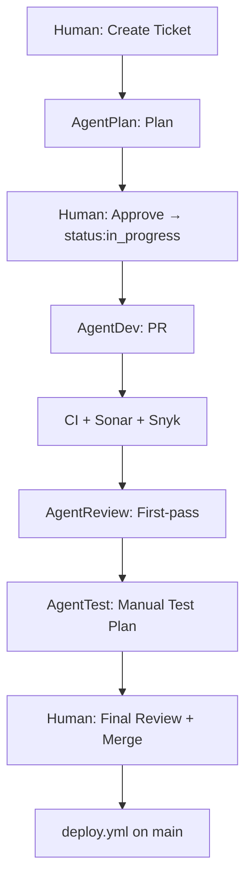

## Agent-driven GitHub lifecycle

This project defines an agent-driven development lifecycle using GitHub Issues and GitHub Actions: issue intake → plan validation → implementation PR → automated quality gates (Sonar + Snyk) → AI first-pass PR review → manual test-case authoring → **human final review and merge** → deploy via GitHub Actions.

### Goals

- Turn a GitHub Issue into a repeatable, auditable workflow where agents can plan, implement, review, quality-check, and propose tests.
- Keep the human in control at plan approval, **final PR review / merge**, and optional deployment environment approval.
- Make quality gates (Sonar + Snyk) blocking and visible on PRs.

### Algorithm

Router details: [`router.yml`](../.github/workflows/router.yml) · label catalog: [`docs/labels.md`](labels.md).

1. **Human** — Issue label **`status:ready`** → **AgentPlan**.
2. **AgentPlan** — Plan under `.cursor/plans/`; push branch; remove **`status:ready`**; hand off to human.
3. **Human** — Approve the plan (optional: **`status:plan_approved`** for visibility only—it does **not** trigger [`router.yml`](../.github/workflows/router.yml)). To run implementation, add issue label **`status:in_progress`** → **AgentDev** (this is the **only** issue label that fires AgentDev).
4. **AgentDev** — Implement; open PR (`Closes #n`); PR label **`agent:review`** → **AgentReview**.
5. **CI** — Sonar + Snyk (and other checks) on the PR.
6. **Human** — PR label **`status:test_plan_requested`** → **AgentTest**.
7. **AgentTest** — Post manual test checklist; does not merge.
8. **Human** — Merge to `main` → **`deploy.yml`**.

**Why several labels?** Each **stage** uses a different **router hook**—you are not stacking multiple labels to start one agent. For example: **`status:ready`** starts planning; later **`status:in_progress`** alone starts AgentDev. Other labels (e.g. **`status:plan_approved`**, **`status:plan_ready`**) are for humans and the issue timeline; only the hooks above match [`router.yml`](../.github/workflows/router.yml) jobs.

### High-level workflow

### Roles and responsibilities

- **Human**: creates issues, applies **router labels** per [`docs/labels.md`](labels.md), validates plans, performs **final PR review and merge**, optionally approves deploys (environment protection).
- **AgentPlan**: produces plans from issues and hands work back to the human for validation.
- **AgentDev**: implements approved plans, opens PRs, and keeps issues updated.
- **AgentReview**: first-pass PR review (comments / request changes); does **not** replace human merge authority.
- **AgentTest**: derives manual test plans from acceptance criteria and changed areas; does not execute tests in CI.
- **GitHub Actions** ([`router.yml`](../.github/workflows/router.yml)): calls Cursor Automation webhooks from **issue/PR labels** (and `workflow_dispatch` for plan replay). **Deploy** runs only in [`deploy.yml`](../.github/workflows/deploy.yml) after merge to `main`.

### GitHub integration

- **Labels:** Full list and router mapping — [`docs/labels.md`](labels.md). This automation does **not** use GitHub Projects; teams may use a board manually outside these workflows.
- **PRs:** Must be linked to issues and use the shared PR template.
- **Quality gates:** Sonar and Snyk workflows report required checks to PRs.

### Deployment

- Merging to the `main` branch triggers [`deploy.yml`](../.github/workflows/deploy.yml) (push workflow).
- Ops may use **workflow dispatch** on `deploy.yml` for manual redeploys (see workflow inputs).
- Optional environment protections can require manual approval before production deploys.
