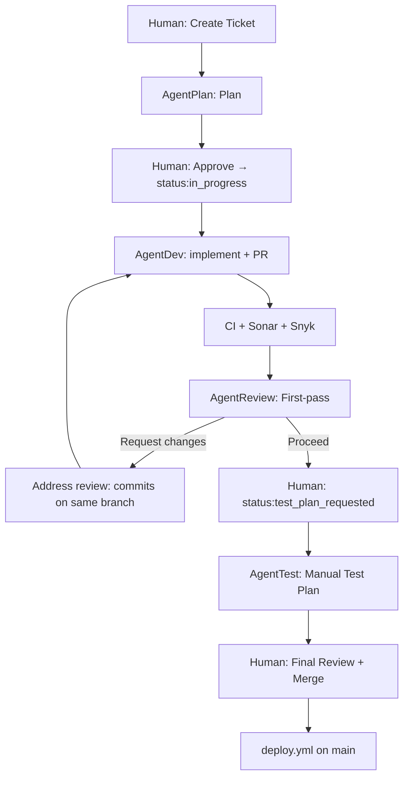

## Agent-driven GitHub lifecycle

This project defines an agent-driven development lifecycle using GitHub Issues and GitHub Actions: issue intake → plan validation → implementation PR → automated quality gates (Sonar + Snyk) → AI first-pass PR review → manual test-case authoring → **human final review and merge** → deploy via GitHub Actions.

### Goals

- Turn a GitHub Issue into a repeatable, auditable workflow where agents can plan, implement, review, quality-check, and propose tests.
- Keep the human in control at plan approval, **final PR review / merge**, and optional deployment environment approval.
- Make quality gates (Sonar + Snyk) blocking and visible on PRs.

### Algorithm

[`router.yml`](../.github/workflows/router.yml) · [`labels.md`](labels.md)

1. **Human** — **`status:ready`** (issue) → **AgentPlan**
2. **AgentPlan** — `.cursor/plans/`, push branch, remove **`status:ready`**
3. **Human** — Approve plan (optional **`status:plan_approved`**); **`status:in_progress`** (issue) → **AgentDev**
4. **AgentDev** — Implement; open PR if needed; **`agent:review`** (PR) → **AgentReview**
5. **CI** — Sonar, Snyk, …
6. **AgentReview** — Comment / request changes; no merge. **Re-review:** toggle **`agent:review`** or edit PR (not on push alone).
7. **If changes needed** — Commit on same PR branch; **re-run AgentDev:** toggle **`status:in_progress`** on issue
8. **Human** — **`status:test_plan_requested`** (PR) → **AgentTest**
9. **AgentTest** — Manual checklist; no merge
10. **Human** — Merge `main` → **`deploy.yml`**

**Labels** — One router hook per stage (`status:ready`, `status:in_progress`, `agent:review`, `status:test_plan_requested`). Toggle **`status:in_progress`** or **`agent:review`** to re-run dev or review after feedback.

### High-level workflow

### Roles and responsibilities

- **Human**: creates issues, applies **router labels** per [`docs/labels.md`](labels.md), validates plans, performs **final PR review and merge**, optionally approves deploys (environment protection).
- **AgentPlan**: produces plans from issues and hands work back to the human for validation.
- **AgentDev**: implements approved plans, opens PRs, and keeps issues updated.
- **AgentReview**: first-pass PR review (comments / request changes); does **not** replace human merge authority.
- **AgentTest**: derives manual test plans from acceptance criteria and changed areas; does not execute tests in CI.
- **GitHub Actions** ([`router.yml`](../.github/workflows/router.yml)): calls Cursor Automation webhooks from **issue/PR labels** (and `workflow_dispatch` for plan replay). **Deploy** runs only in [`deploy.yml`](../.github/workflows/deploy.yml) after merge to `main`.

### GitHub integration

- **Labels:** Full list and router mapping — [`docs/labels.md`](labels.md). This automation does **not** use GitHub Projects; teams may use a board manually outside these workflows.
- **PRs:** Must be linked to issues and use the shared PR template.
- **Quality gates:** Sonar and Snyk workflows report required checks to PRs.

### Deployment

- Merging to the `main` branch triggers [`deploy.yml`](../.github/workflows/deploy.yml) (push workflow).
- Ops may use **workflow dispatch** on `deploy.yml` for manual redeploys (see workflow inputs).
- Optional environment protections can require manual approval before production deploys.
