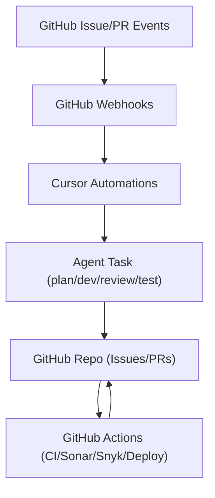

## Cursor Automations integration

This document explains how this agent-driven GitHub lifecycle works when wired up with Cursor Automations, and how responsibilities are split between GitHub, GitHub Actions workflows, and Cursor.

### 1. Overview

The repository defines an agent-driven development lifecycle on top of GitHub:

- Human creates a ticket (GitHub Issue) and assigns it to an AI agent.
- AgentPlan generates a plan and hands it back to the human for validation.
- After approval, AgentDev implements the change and opens a PR.
- The PR goes through automated quality gates (CI, Sonar, Snyk) and **first-pass** AgentReview.
- AgentTest produces a **manual** test plan (it does not run the automated test suite).
- A **human** performs **final review and merges** to `main`.
- **GitHub Actions** deploys via [`deploy.yml`](../.github/workflows/deploy.yml) on push to `main` (no Cursor deploy agent).

Cursor Automations provide the glue between GitHub events and these agents. **[`router.yml`](../.github/workflows/router.yml)** posts JSON payloads to each automation’s **webhook URL** (repository Actions secrets).

For a **short numbered algorithm** (step 1 → step 10), see **[`docs/agent-dev-lifecycle.md`](agent-dev-lifecycle.md) — Algorithm**.

### 2. High-level architecture

There are three main systems involved:

- **GitHub**: issues, pull requests, labels, reviews, and branch protection rules.
- **GitHub Actions workflows**: CI, quality gates, deployment, and **webhook routing** (`router.yml`), defined under `.github/workflows/`.
- **Cursor Automations**: long-running, agent-powered workflows that react to GitHub events and update GitHub (comments, labels, PRs, code via PRs).

The overall flow looks like this:

### 3. How Cursor receives events from GitHub

Once this repository is connected to Cursor Automations:

- Cursor configures **GitHub webhooks** for the repo.
- GitHub sends events to Cursor for actions such as:
  - Issue created / edited / labeled.
  - Pull request opened / synchronized / labeled.
  - Projects v2 item updates (optional).
- Each Automation defines a **trigger** that filters these events by:
  - Event type (issue, `pull_request`, etc.).
  - Action (opened, labeled, edited).
  - Fields such as labels, branches, or repository name.

**Human-facing router triggers** are **labels** on issues and PRs. The Project **Status** field is for board visibility (agents update it via GraphQL); **GitHub Actions does not listen to Project Status**. Canonical label list: **[`docs/labels.md`](labels.md)**.

**AgentPlan entry ([`router.yml`](../.github/workflows/router.yml)):**

1. **Human action:** add issue label **`status:ready`** (ready for planning).
2. **Router trigger:** `issues` `opened` (if the label is already present) / `labeled` with `status:ready`, or `workflow_dispatch` replay.

Downstream: **`status:in_progress`** (AgentDev), **`agent:review`** (AgentReview), **`status:test_plan_requested`** (AgentTest), plus lifecycle labels such as `status:plan_approved`, `status:plan_ready`, etc.

**Project Status during automation** (agents use GraphQL `updateProjectV2ItemFieldValue`; resolve project/item/field/option ids per §9):

| Phase | Project Status |
| ----- | -------------- |
| Human starts planning | Ready |
| AgentPlan working | In progress |
| Plan posted; human approval | Ready |
| AgentDev implementing | In progress |
| PR linked to issue | In review |
| Merged / complete | Done |

**Router + webhooks:** [`router.yml`](../.github/workflows/router.yml) **POSTs** `{ "issue_number" }` or `{ "pull_request_number" }` to Cursor. Register **four** automations and store URL/token pairs as Actions secrets (§9).

### 4. Role of GitHub workflows

GitHub Actions workflows in `.github/workflows/` handle non-AI automation and **invoke** Cursor webhooks:

- [`ci.yml`](../.github/workflows/ci.yml): runs linting and build on pushes and pull requests.
- [`sonar.yml`](../.github/workflows/sonar.yml): runs a Sonar scan and reports a quality gate status on PRs.
- [`snyk.yml`](../.github/workflows/snyk.yml): runs Snyk scans for dependency and code-level vulnerabilities on PRs.
- [`deploy.yml`](../.github/workflows/deploy.yml): builds and deploys on **push** to `main`; optional **`workflow_dispatch`** for ops manual redeploys (see workflow inputs).
- [`router.yml`](../.github/workflows/router.yml): on **human-applied `status:*` labels** and PR **label** events, calls the **AgentPlan / AgentDev / AgentReview / AgentTest** webhooks (see [`docs/labels.md`](labels.md)).

These workflows are responsible for:

- Ensuring code compiles and passes basic checks.
- Providing quality and security gates (Sonar and Snyk).
- Deploying code after merge (and optionally redeploying a ref via `workflow_dispatch`).

They do **not** run the AI logic themselves—that runs in Cursor Automations after the webhook fires.

### 5. Role of Cursor Automations

Cursor Automations are responsible for:

- Running AI-powered agents (planning, implementation, review, test-plan).
- Reading and modifying repository code (through the Cursor project).
- Creating and updating GitHub artifacts:
  - Issue comments.
  - Labels and assignments.
  - Pull requests and PR descriptions.
  - PR reviews and test plans.

Each Automation typically:

1. Is triggered by a GitHub event and label combination (often after `router.yml` POSTs to the webhook).
2. Loads repository context and relevant GitHub payload (issue/PR data).
3. Runs an agent task (e.g. plan, dev, review, test).
4. Writes results back to GitHub.

### 6. Event-to-agent mapping

The following sections show how GitHub events map to agent actions via Cursor Automations and `router.yml`.

#### 6.1 Planning (AgentPlan)

The **human-facing trigger** is issue label **`status:ready`** (ready for planning). [`router.yml`](../.github/workflows/router.yml) POSTs the webhook.

- **Trigger (router):** `workflow_dispatch`; or `issues` with **`status:ready`** (`opened` / `labeled`).
- **Payload:** `{ "issue_number": "<n>" }`.
- **Automation actions**:
  - Set Project **In progress** while planning, then **Ready** when the plan is posted (per prompt).
  - Commit plan under `.cursor/plans/`, push, post issue comment, set labels (`status:plan_ready`, `needs:human_input`), remove **`status:ready`** so the router does not re-fire, **assign back to human** per prompt.
- **GitHub workflows:**
  - [`router.yml`](../.github/workflows/router.yml) sends the webhook; Cursor Automations perform the planning.

#### 6.2 Implementation (AgentDev)

- **Trigger (router):**
  - `issues` with label **`status:in_progress`** (`opened` if already present, or `labeled`).
- **Payload:** `{ "issue_number": "<n>" }`.
- **Automation actions**:
  - Read plan file `.cursor/plans/issue-<n>-*.plan.md`.
  - Continue on the **same** `implementation_branch` AgentPlan created (see plan file frontmatter); open a PR into `main` (`Closes #n`), label PR `agent:review`; set Project **In progress** during implementation, **In review** after the PR is linked to the issue (see [`docs/agent/prompt/agent-dev-prompt.md`](agent/prompt/agent-dev-prompt.md)).
- **GitHub workflows:**
  - `ci.yml`, `sonar.yml`, and `snyk.yml` run on the PR and report status checks.

#### 6.3 Review (AgentReview) — first pass; human merges

- **Trigger (router):**
  - `pull_request` **opened**, **edited**, or **labeled** with `agent:review` (not on every `synchronize` push, to avoid duplicate webhook spam).
- **Payload:** `{ "pull_request_number": "<n>" }`.
- **Automation actions**:
  - Read the PR diff, linked issue, and plan; keep linked issue Project **In review** if updating Status.
  - Run a **first-pass** review (prefer **comment** or request changes); **do not merge** (see [`docs/agent/prompt/agent-review-prompt.md`](agent/prompt/agent-review-prompt.md)).
- **Sonar + Snyk + CI** are required quality signals on the PR; the agent must not treat the PR as ready if required checks are failing.
- **Human** performs **final review and merge** after the manual test plan (when applicable).

#### 6.4 Test-plan (AgentTest)

- **Trigger (router):**
  - `pull_request` **`labeled`** with **`status:test_plan_requested`**.
- **Payload:** `{ "pull_request_number": "<n>" }`.
- **Automation actions**:
  - Generate a **manual** test checklist (PR body or `docs/test-plans/`) per [`docs/agent/prompt/agent-test-prompt.md`](agent/prompt/agent-test-prompt.md); keep Project **In review** if updating Status.
  - Optionally label `status:test_plan_ready`.
- **GitHub workflows:**
  - No extra workflow required for authoring the checklist.

#### 6.5 Deploy (GitHub Actions only)

- **Trigger:**
  - **Push** to `main` after merge runs [`deploy.yml`](../.github/workflows/deploy.yml).
  - Optional **`workflow_dispatch`** on `deploy.yml` for ops redeploy of a given ref.
- **Cursor:** no deploy automation; no deploy webhook in `router.yml`.

### 7. Labeling strategy

**Router webhooks** follow **[`docs/labels.md`](labels.md)**:

- **AgentPlan:** Human adds issue **`status:ready`**.
- **AgentDev:** Human adds issue **`status:in_progress`** after plan approval.
- **AgentReview:** PR **`agent:review`** (typically from AgentDev).
- **AgentTest:** Human adds PR **`status:test_plan_requested`**.
- Automations can apply follow-up labels such as:
  - `status:plan_ready`, `status:plan_approved`.
  - `status:implementing`, `status:pr_open`, `status:ready_for_merge`, `status:done`.
  - `needs:human_input`, `quality:failed`.

[`router.yml`](../.github/workflows/router.yml) uses these labels (and `workflow_dispatch` for plan replay) to decide when to call each Cursor webhook.

### 8. End-to-end example

1. **Plan**  
   - Human creates an issue and adds **`status:ready`** when ready for planning.  
   - `router.yml` triggers AgentPlan; the automation updates Project Status per §3 table, commits a plan file, posts on the issue, sets `status:plan_ready` / `needs:human_input`, removes **`status:ready`**, assigns back to the human.

2. **Approve and implement**  
   - Human reviews the plan and sets `status:plan_approved`, then adds **`status:in_progress`** to start AgentDev.  
   - AgentDev runs, implements, opens a PR, labels `agent:review`.

3. **Quality checks**  
   - CI, Sonar, and Snyk run on the PR as required checks.

4. **First-pass review**  
   - When the PR is labeled `agent:review`, `router.yml` triggers AgentReview for a **first-pass** review (not a substitute for human merge).

5. **Test plan**  
   - Human labels the PR **`status:test_plan_requested`**.  
   - AgentTest adds a **manual** test checklist (no claim that automated tests were run here).

6. **Human merge and deploy**  
   - A **human** performs **final review** and **merges** to `main`.  
   - [`deploy.yml`](../.github/workflows/deploy.yml) runs on the push to `main`.

### 9. Configuration checklist

To enable this flow with Cursor Automations:

- Connect this GitHub repository to Cursor Automations.
- Register **four** automations (plan, dev, review, test) using the JSON under [`docs/agent/automation/`](agent/automation/) and prompts under [`docs/agent/prompt/`](agent/prompt/).
- In **GitHub → Settings → Secrets and variables → Actions**, add:

| Secret | Used by |
| ------ | ------- |
| `AGENT_WEBHOOK_URL_PLAN` and `AGENT_WEBHOOK_TOKEN_PLAN` | AgentPlan (optional: legacy `AGENT_WEBHOOK_URL` / `AGENT_WEBHOOK_TOKEN` still work as fallback for plan) |
| `AGENT_WEBHOOK_URL_DEV` and `AGENT_WEBHOOK_TOKEN_DEV` | AgentDev |
| `AGENT_WEBHOOK_URL_REVIEW` and `AGENT_WEBHOOK_TOKEN_REVIEW` | AgentReview |
| `AGENT_WEBHOOK_URL_TEST` and `AGENT_WEBHOOK_TOKEN_TEST` | AgentTest |

- **Agents updating Project Status:** Prompts use GraphQL `updateProjectV2ItemFieldValue`. Store **non-secret** ids as **Variables** (e.g. `PROJECT_V2_ID`, field ids, option ids for Backlog / Ready / In progress / In review / Done) or discover them at runtime via GraphQL; never commit tokens.
- **Token permissions:** Default `GITHUB_TOKEN` in Actions has limited Project scope; org policies may require a **PAT** or GitHub App for agents to mutate Project fields—validate in your org.
- Map router events to your Cursor webhook endpoints (each automation has its own URL in Cursor).
- Ensure the label set described in `docs/agent-dev-lifecycle.md` / `docs/labels.md` exists in the GitHub repository.
- Configure branch protection: require CI, Sonar, and Snyk where appropriate; require **human** reviewers for final merge if that is your policy.
- Optionally configure environments and approvals for [`deploy.yml`](../.github/workflows/deploy.yml).

### 10. Prototype verification (Ready → AgentPlan)

After secrets and labels exist on the repo, validate end-to-end:

1. **Smoke (replay):** In GitHub **Actions** → **Agent Router** → **Run workflow**, set `issue_number` to a real issue that has (or will have) planning context. Confirm the **`agent-plan`** job succeeds and Cursor AgentPlan runs (webhook + automation logs).
2. **Issue path:** Open a test issue → add **`status:ready`** → confirm **`agent-plan`** runs → AgentPlan produces `.cursor/plans/` + issue labels → approve plan → add **`status:in_progress`** → **`agent-dev`** runs → PR + CI/Sonar/Snyk as configured.
3. **PR path:** Label **`agent:review`** for review; when ready for test plan, label **`status:test_plan_requested`** → human merge → confirm [`deploy.yml`](../.github/workflows/deploy.yml) on push to `main`.

Stop at the first failure and fix secrets, [`router.yml`](../.github/workflows/router.yml) `if:` conditions, or Cursor automation triggers before continuing.
